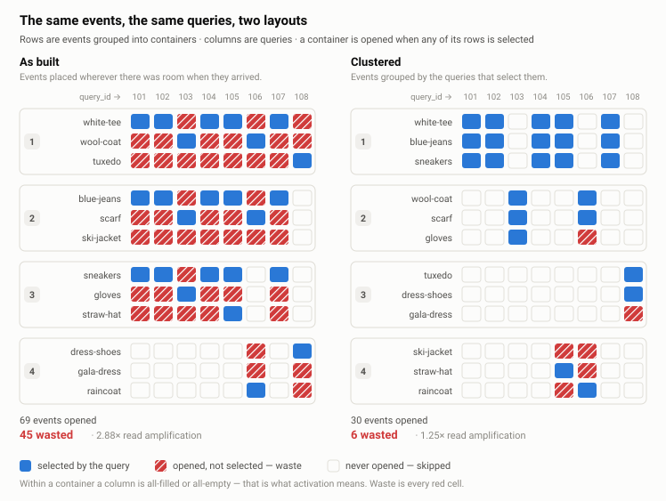
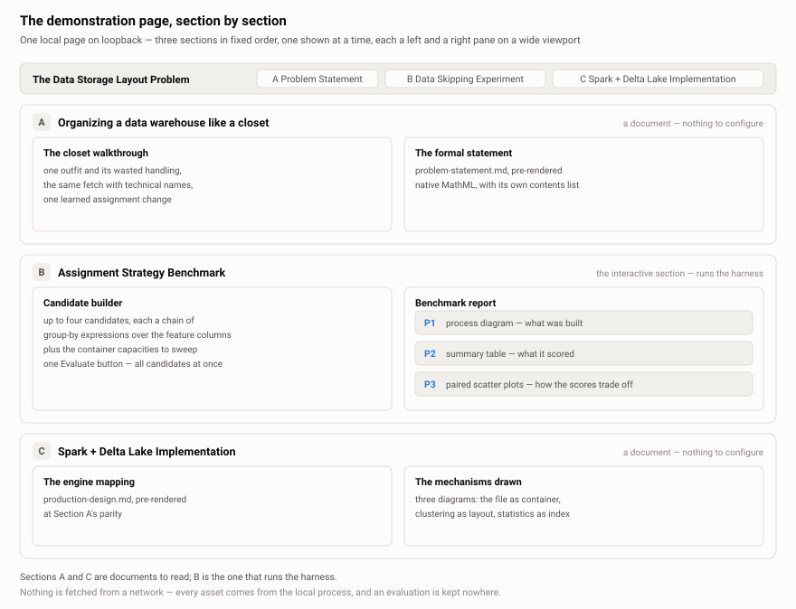

# dataclustering-solver

Score a data clustering strategy against a recorded workload, and find out how much of what the
queries read was wasted.

---

## The problem

Storage engines read in whole **containers** — files, blocks, partitions. A query that wants three
records out of a file reads the entire file and discards the rest. That discarded volume is
**waste**, and the waste summed across a workload is the quantity this project measures.

The cost of a query therefore depends less on the records it selects than on what those records
happen to sit beside. An index sharpens the first half of that sentence and cannot touch the
second: a per-record index tells the engine exactly which containers hold a match, so no container
is ever opened for nothing, but once a container is open, what else is inside it was settled long
before the query arrived.

What settles it is the **layout** — which records are stored next to which other records. That is
the single lever that changes how much data a query must read to answer the same question, and it
is the only decision this project is about. The formal treatment, with model, objective,
constraints and complexity, is in
[problem-statement.md](project_metadata/problem-statement.md).

## A worked example

Picture a closet. It has the three properties that make data layout hard, and you can see all of
them at once.

- **You retrieve by the drawer, not by the garment.** Everything folded in with what you wanted
  gets lifted out and put back for nothing.
- **A list tells you which drawers to open.** Taped inside the door is one line per garment saying
  what it is and which drawer holds it. Reading twelve lines costs nothing; lifting out twelve
  garments is the whole morning. The list is exact, so you never open a drawer for nothing — but
  it cannot tell you what *else* you will find once a drawer is open.
- **The closet keeps changing.** Garments come and go, the weather turns, and an arrangement that
  suited March is mediocre by September. There is no way to close the closet while you fix it.

One number carries the whole problem: the garments handled but not worn.

| in the closet | in a storage system |
| --- | --- |
| a garment | an **event**, the stored item |
| a drawer or cabinet | a **container**, the smallest thing that can be opened |
| this morning's outfit | a **query**, and the events it selects |
| garments handled, not worn | **waste**, work paid for at value zero |
| which garment lives in which drawer | the **layout**, the one thing under our control |

<picture>
  <source media="(prefers-color-scheme: dark)" srcset="resources/img/selection-matrix.dark.svg">
  
</picture>

Each row above is a garment, each column a morning, and a filled cell means that morning called for
that garment. The boxes are the drawers. **The two panels differ in one respect only: which
garments were put in which drawer.** The closet, the mornings and the record of what was worn are
identical between them. Blue is what you wanted and red is what you handled anyway; inside a
drawer, a column is either all filled or all empty, because one garment you want obliges the whole
drawer. On the left, 45 garments were handled for nothing. On the right, 6.

<picture>
  <source media="(prefers-color-scheme: dark)" srcset="resources/img/container-zoom.dark.svg">
  
</picture>

Zooming in on a single morning shows why the arrangement is worth so much. A drawer meets one of
two fates. If it holds something you want, you open it and pay for everything inside; if it holds
nothing you want, you never touch it, and it costs nothing at all — not a partial read, not a
filtered read. Skipping is the only free operation in the system, which is why the whole exercise
is about causing more of it.

> **[Open the interactive version →](https://claude.ai/code/artifact/bc148f2d-9ed7-4959-9aca-f1fa715f64f4)**
> Twelve garments and eight mornings, with one garment you can move between drawers to watch the
> waste recount. Source: [closet-canvas.html](resources/graphics/closet-canvas.html), which is
> self-contained and opens in a browser with no install.

## Why this is hard to get right

The theory is settled and the news is bad. The problem reduces to balanced MaxSkip partitioning,
which is NP-hard, over a search space super-exponential in the number of records. No exact method
is coming, so this is heuristic territory — and the only way to find out whether a given heuristic
helps is to measure it.

Measuring it is where the difficulty moves, for three reasons.

1. **Scoring one layout costs a full pass over the selection log** — the record of which queries
   selected which events. A search that wants to try a thousand candidates pays that cost a
   thousand times, which is why scoring belongs in a harness built for it rather than inside every
   strategy that needs it.
2. **The selection log is usually not recorded.** Query engines log predicates, plans and timings,
   but not which rows came back. Recovering it means replaying queries offline, instrumenting the
   application that issues them, or sampling and accepting the error. Each option is honest and
   each has a cost; [production-design.md](project_metadata/production-design.md) §6 sets them out.
3. **A good layout decays on its own.** Records arrive, workloads shift, and rewriting to catch up
   costs real work. The harness therefore reports decay epoch by epoch, so the shelf life of a
   layout shows up in the numbers rather than in an argument about them.

## What this repository holds

Two things, and one deliberate omission.

**A harness** turns a layout into numbers. It takes a dataset — synthetic, or a CSV export you
adopt — together with a strategy registered against the plugin seam, and evaluates the resulting
layout across a sweep of container sizes. Queries are split temporally, so a strategy sees the
training half while every reported number is measured on held-out queries it never had. Results
land beside a workload-agnostic baseline, because that comparison is what decides whether a rewrite
is worth doing. Alongside the read cost, the harness charges what the read cost hides: a layout of
many tiny containers wins on waste and loses in production, once every container costs a log entry,
a task and a round trip. The report gives that cost its own axis so both halves of the trade-off
stay visible. The requirements, seam by seam, are in
[simulator-spec.md](project_metadata/simulator-spec.md).

**An engine mapping** translates the abstract problem onto Delta Lake and Spark, naming the
mechanism that realizes each part of the model, together with the seven places where the engine
cannot honour what the model assumes.

**No clustering strategy ships as a recommendation.** Strategies are third-party plugins. What the
repository ships is the scoreboard, and the one strategy family it does include — group-by chains
with capacity bucketing, configured in the GUI — is a demonstration fixture whose purpose is to
make the objective legible, never advice about how to lay data out.

## Quickstart

Python 3.12 or later. The dependencies come in **two sets that do not overlap**, and which one
you need depends on what you are doing. Serving the page needs FastAPI on uvicorn and nothing
else — the figures it shows were computed ahead of time. Producing those figures needs the
harness: numpy, pyarrow and matplotlib.

```
uv sync --extra harness          # the harness, pinned from uv.lock
python -m simulator generate     # bootstrap a corpus  (once, a few minutes)
python -m simulator catalog      # score the strategies Section B presents  (~8s)
python -m simulator gui          # serve the page
```

The page is served at **`http://127.0.0.1:8765/`** and the launch opens it for you; the process
prints the address as it binds, so a closed tab is one glance away from being reopened. Loopback
and port 8765 are the defaults — `--port` moves it, and `--no-browser` suppresses the opening.
The same command serves a deployed instance, which differs only in what the environment tells it:
where to bind, what path prefix it is mounted under, and the secret its front door presents.

`pip install -e ".[harness]"` works as well. There is no console script, by design, so
`python -m simulator` is the only invocation form.

**The corpus never leaves your machine, and the page never reads it.** `generate` writes it under
`data/generated/`, `catalog` reads it once and writes a 160 kB document under `data/catalog/`, and
`gui` serves that document. Neither the corpus nor the harness reaches a deployed instance: an
install without the `harness` extra can serve the page and cannot score anything, which is what
keeps a 24/7 instance at tens of megabytes rather than hundreds. A harness command run without
that extra says so and names it.

`python -m simulator run` is the other harness command: it sweeps the dataset across the full
capacity range and writes a durable metric table and a static report under `data/`. It is also
where you go to score **your own** group-by chain against your own corpus — the page presents a
fixed catalogue, and composing a new strategy is command-line work by design.

Launching twice is safe. Before binding, the server asks the port who is holding it. If an existing
instance of itself answers, you are offered a restart, a shutdown, or the option to leave it
running; a listener that is not this server is reported and left alone. The flags `--stop`,
`--restart`, `--no-browser` and `--port` settle the same questions without the prompt.

## A tour of the page

<picture>
  <source media="(prefers-color-scheme: dark)" srcset="resources/img/page-anatomy.dark.svg">
  
</picture>

The page carries three sections in the order the argument runs, and shows one at a time — the top
bar selects which, and a link to a section's anchor opens the page on it.

| section | what it is for |
| --- | --- |
| **A · Problem Statement** | a closet-to-warehouse walkthrough, beside the formal framework, pre-rendered with native MathML and its own contents list |
| **B · Data Skipping Experiment** | compose up to four candidates, sweep each across container capacities, and read them against the industry-default baseline |
| **C · Spark + Delta Lake Implementation** | the engine mapping, at Section A's parity, beside three diagrams of the mechanisms it names and the twelve-event table illustrations |

Section B is where the harness earns its keep. A candidate is a chain of group-by expressions over
the dataset's feature columns, and each resulting subset is cut into containers of at most a given
record count. The expressions come from a closed grammar — a column, one operator and a literal —
parsed to data and evaluated by an interpreter over the column, never by executing text. An
expression naming a column the dataset does not carry, or comparing against a literal its dtype
cannot hold, is refused before anything runs.

**The page presents a catalogue rather than a form.** Six candidates are scored ahead of serving,
each swept across four container capacities and measured against the baseline on both the training
and held-out query sets. The left panel lists them with what each one does to the corpus — the
chain, how many splits the corpus stands in after each stage, and how many containers that came to
at each capacity — and you choose up to four to compare. Choosing redraws three views in fixed
order: **P1**, the process diagram, showing what was built; **P2**, the summary table, showing what
it scored; and **P3**, a pair of scatter plots showing how the scores trade off, with both axes
costs so that lower-left is better.

The catalogue is a set of **demonstration fixtures**, chosen to span a range of shapes and listed
from the coarsest split to the finest. That order is a property of the chains, not a ranking, and
that one of them scores well is a fact about this corpus and this workload. This project proposes
no assignment strategy.

**Nothing is computed while you are looking at it.** An earlier version of this page let you
compose candidates in the browser and scored them on demand; it worked, and it cost a corpus
resident in the serving process for that process's life and seconds of CPU per click, on every
deployed instance whether or not anyone pressed the button. Since the family and its capacity
sweep are both bounded, the space you could reach was always small enough to enumerate — so it is
enumerated once, offline, by `python -m simulator catalog`. Scoring a chain of your own is exactly
as available as it was, at the command line, against any corpus.

What the server does is therefore small: it reads one document at startup and serves finished HTML
— a small FastAPI application on uvicorn, with no template engine, no bundler, no build step and
nothing fetched from a CDN. What the repository holds is what the browser receives, which is what
makes that last claim something a reader can check by reading a file. Section B's whole server-side
surface is a single GET, and no request carries anything you typed.

## Repository layout

```
simulator/
  core/            the dataset contract, the layout, and the metric primitive
  providers/       corpus generation behind that contract: synthetic, or an adopted export
  strategies/      the plugin registry, the expression seam, the demonstration family
  config/          the capacities the sweep and the GUI's baseline run across
  bench/           the sweep and the metric table it appends to
  report/          static charts and the report page `run` writes
  gui/             the local server, its JSON API, and the page it serves
tests/             the suite, plus a DOM stand-in for the page's ES modules
tools/             the two generators for committed artifacts
project_metadata/  the problem statement, its appendix, the engine mapping, and the two specs
resources/         committed artifacts: the figures, the graphics, and the scenario JSON
data/              written at run time and never committed: corpora, metrics, reports, logs
```

## Development

The build backend is setuptools and the package needs Python 3.12 or later. Two extras sit
alongside the five runtime dependencies: `dev` for the test suite, and `docs` for the tooling that
re-renders the two long documents.

```
uv sync --extra dev        # or: pip install -e ".[dev]"
python -m pytest           # testpaths = ["tests"]
```

Plain `uv sync` installs the five runtime dependencies and nothing else, so it *removes* pytest if
it is already there. The `dev` extra is what makes the second line work; it pulls in `docs` as
well, since the pre-render tests import that tooling.

The suite asserts the harness, the JSON interface, and the page's JavaScript against a DOM
stand-in. **The page's layout is checked by opening it**, because pane scrolling, the
narrow-viewport breakpoint and the plots' shared width have no automated check, by decision
(12.6.3.1).

Static resources under `simulator/gui/static/` are authored by hand, with two exceptions. The
pre-rendered document pages come from `python -m tools.render_formulation` and are committed so
that a default install can serve them, and the figures under `resources/img/` come from
`python3 tools/render_figures.py` and are never hand-edited.

Every run writes an execution log to `data/logs/`, one file per run. Nothing prunes them, so
`rm -rf data/logs` when they are in the way.

## Further reading

| document | what it is |
| --- | --- |
| [problem-statement.md](project_metadata/problem-statement.md) | the formal statement: storage model, observed workload, objective, random-query skipping model, clustering effect, constraints and complexity. Written for software engineers and sequenced to teach each concept before its notation |
| [problem-statement-appendix.md](project_metadata/problem-statement-appendix.md) | the terminology reference and Poisson approximation derivation supporting the formal statement |
| [production-design.md](project_metadata/production-design.md) | the engine mapping: which Databricks and Spark mechanism realizes each formal object, and where the engine cannot honour the model. Downstream of the problem statement, and it never amends it |
| [simulator-spec.md](project_metadata/simulator-spec.md) | requirements for the problem, the harness and the plugin seams, in §1 to §11, individually numbered |
| [ui-spec.md](project_metadata/ui-spec.md) | requirements for the demonstration GUI, in §12 and §13, continuing the same numbering |
| [term-dictionary.md](project_metadata/term-dictionary.md) | the vocabulary this project coins, as a key-value lookup. Terms an established field already names are absent by design |
| [closet-canvas.html](resources/graphics/closet-canvas.html) | the interactive closet: move an event, watch waste recount. Self-contained, and opens in a browser |
| [architecture-canvas.html](resources/graphics/architecture-canvas.html) | the simulator's components and the data flowing between them, with the contract line and the layout line drawn |
| [closet-scenario.json](resources/data/closet-scenario.json) | the worked example above as data: events, queries, selection log, two layouts. Source of truth for every scenario figure and for the canvas |
