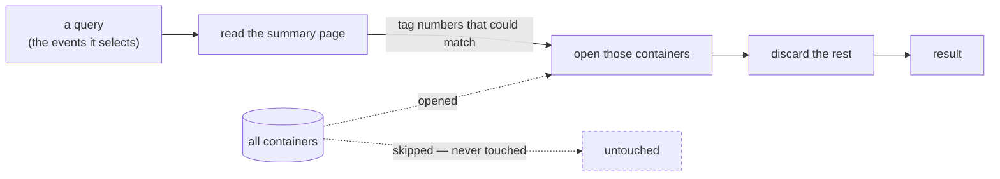
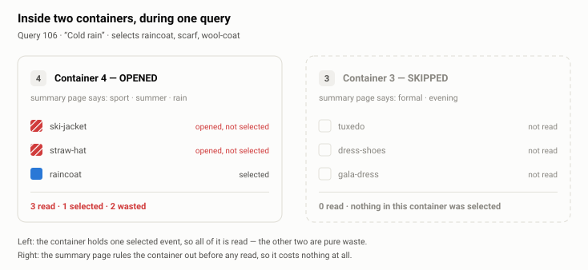

# dataclustering-solver
[Monetize] your data lake heuristics - Turn data usage insights into clustering decision trees and cloud saving

---

## The Problem

### Start with a closet, because the mechanics are identical

You own a closet. It holds a few thousand garments. Every morning you fetch an outfit — a
handful of items out of the thousands available.

This is not a story about clothes. A closet is a storage system with exactly the properties
that make data layout hard, and it is far easier to reason about than a storage system you
cannot see. Everything below holds for both, and the vocabulary is used interchangeably from
here on.

### The three rules that make the closet interesting

**You cannot fetch one garment.** To retrieve a shirt you open the drawer holding it, lift
the garments folded on top, and put them back. The unit of work is the *container*, not the
item. Every other garment in that drawer was handled for nothing. A storage system behaves
the same way: it reads whole containers, then discards the rows you did not ask for. You pay
for what you opened, not for what you kept.

**You have tags and a summary page.** Every drawer and cabinet door carries a sequence
number. A single page lists, against each number, a short description of what is inside.
Before touching the closet you read the page, work out which tag numbers could possibly hold
what you want, and open only those. A storage system keeps the same page: a compact index
that maps container identifiers to a summary of their contents, cheap enough to consult
before any real work begins.

The page is what makes skipping possible, and **this project takes it for granted.** Assume it
is always right and costs nothing to read: hand it a morning's requirements and it names
exactly the drawers holding something you need — never missing one, never sending you to a
drawer for nothing. Writing such a page and keeping it accurate is a real problem, and it is
not this one. Consulting the page is free; opening a drawer is not, and everything below lives
in that gap.

**The closet is never finished.** Garments are discarded, new ones arrive, and what you
reach for drifts with the season and with the job. A layout that was excellent in March is
mediocre by September. Worse, you cannot close the closet to rearrange it: it has to keep
storing and loading, every day, while it changes.

### What gets written down

One table records everything we know about demand. Each morning gets an identifier, and every
garment that morning actually called for gets a row:

| `Event_ID` | `Query_ID` |
| --- | --- |
| white-tee | 101 |
| blue-jeans | 101 |
| sneakers | 101 |
| wool-coat | 103 |
| scarf | 103 |
| gloves | 103 |
| straw-hat | 105 |
| … | … |

That is the whole schema. A row's presence *is* the fact — this query selected this event.
There is no true/false column, because only selections are logged; a garment you did not wear
on Monday simply has no Monday row. The table is append-only: new usage statistics arrive as
new rows, and nothing is ever rewritten.

Two things follow that are easy to miss. A garment nobody has ever worn appears in the closet
but **nowhere in the table at all**. And because the log only grows, the layout you chose last
year is being judged against evidence that did not exist when you chose it.

### The same picture in a data store

| closet | storage system |
| --- | --- |
| garment | event — the stored item, keyed by `Event_ID` |
| drawer, cabinet | container — the smallest thing that can be opened |
| this morning's outfit | query, keyed by `Query_ID`; the events it selects |
| opening a drawer | reading a container |
| garments handled, not worn | **waste** — work paid for, value zero |
| a drawer you never opened | a **skipped** container, the entire point |
| tag numbers + summary page | the index consulted before the read — assumed free and always right |
| which garment lives in which drawer | the **layout** — the one thing under our control |
| taste drifting with the season | workload drift |
| the record of what you wore | the usage log that tells us what the layout should be |

### The summary page, as a table

Here is the page for a well-organized closet — four drawers, four short entries:

| Tag | Summary page entry | What is actually inside |
| :-: | --- | --- |
| 1 | casual · all-season | white-tee, blue-jeans, sneakers |
| 2 | winter · wool | wool-coat, scarf, gloves |
| 3 | formal · evening | tuxedo, dress-shoes, gala-dress |
| 4 | sport · summer · rain | ski-jacket, straw-hat, raincoat |

On a cold rainy morning you need the wool coat, the scarf and the raincoat. Reading the page
alone — before opening anything — rules out tags 1 and 3 and sends you to tags 2 and 4. You
open six garments to collect three.

The page decides *which* drawers you open, and we are taking it as given that it decides
correctly. What it has no say over is what you find once a drawer is open — six garments
handled to collect three, here. That second number is set entirely by which garments were put
together, and it is the number this project is about.

### What we are measuring: garments handled but not worn

Every query has a set of events it genuinely needs. Because containers are the unit of
reading, it also drags in every event that happens to share a container with one of them. The
difference between those two — events opened but not selected — is **waste**, and the sum of
that waste across every query the system serves is the number this project exists to reduce.

<picture>
  <source media="(prefers-color-scheme: dark)" srcset="docs/img/usage-matrix.dark.svg">
  
</picture>

Every row is an event, every column a query, and every blue cell one row of the usage log.
The containers are the boxes drawn around groups of rows — and that grouping is the *only*
difference between the two panels. Same closet, same mornings, same log. Reading the picture:

- Inside a container, a column is either **entirely filled or entirely empty**. That is what
  activation means — one selected event obliges the whole container.
- Blue cells are the events you actually wanted. Red cells are the ones you paid for anyway.
- The left layout wastes 45; the right wastes 6. Nothing changed but where things sit.

Waste has a useful property: it is entirely the layout's fault. Which events a query needs is
fixed by the question being asked. Which events it is forced to open alongside them is
decided by where we chose to put things. Nothing else in the pipeline moves this number.

### A closer look: one drawer opened, one skipped

<picture>
  <source media="(prefers-color-scheme: dark)" srcset="docs/img/container-zoom.dark.svg">
  
</picture>

The two outcomes available to any container, on the same cold rainy morning:

**Opened.** Drawer 4 holds the raincoat, so the whole drawer is read. The ski jacket and the
straw hat come along for the ride and are discarded — three events read to deliver one. This
is co-location doing its damage: the raincoat's neighbours pay the raincoat's bill.

**Skipped.** Drawer 3 holds nothing this morning calls for, so the page never sends you there
and it is not touched at all. It costs nothing — not a partial read, not a filtered read,
nothing. Skipping is the only operation in the system that is genuinely free, and every design
decision is ultimately about causing more of it.

Two extremes bracket the problem. If every event sits in its own container, waste is zero and
the summary page is longer than the closet. If every event sits in one container, the page is
a single line and every query reads everything. Every real layout lives between them, and the
useful question is where.

> **[Open the interactive version →](https://claude.ai/code/artifact/bc148f2d-9ed7-4959-9aca-f1fa715f64f4)**
> Same twelve events and eight queries, but you can move an event between containers and watch
> the waste recount, focus a single query to see what it opens, and read the log it is all
> derived from. Source: [docs/canvas/closet-canvas.html](docs/canvas/closet-canvas.html).

### Why choosing a layout is hard

**Co-location is contagious.** Putting a rarely-used garment in the same drawer as a daily
one means it now gets handled daily. A container inherits the combined demand of everything
inside it, so a single popular event can make an entire container hot. Grouping is not
symmetric or forgiving: one bad neighbour spoils the drawer.

**The grouping that matters is often not the one you can name.** The log says *which* events a
query selected, never *why*. The structure worth exploiting is usually latent in the usage
history rather than stated in the request, so it has to be discovered rather than read off.
The column you would naturally partition on is rarely the one that matters.

**Usage is lopsided.** A small fraction of events absorbs most of the demand while a long tail
is almost never touched, and some events never appear in the log at all. The right container
size differs between those regimes, which means no single uniform granularity is correct
anywhere.

**Granularity has a floor.** Finer containers always waste less — split them far enough and
waste hits zero, one garment per drawer. What stops you is that opening a drawer costs
something no matter how little is inside, so past a certain smallness the per-drawer overhead
swamps the saving. Since consulting the page is free, that floor is the *only* thing holding
the layout back, which turns the real question into how close to it you can get where it
matters — not whether finer is better.

**The search does not fit.** The number of ways to divide events among containers is
astronomically large, choosing the best one is provably intractable in general, and merely
scoring a single candidate means replaying the entire log against it. There is no enumerating
your way out.

**The target moves.** Events churn and demand drifts, so a layout decays even when nobody
touches it. Rearranging costs real work, which has to be repaid by the queries it speeds up,
and it has to happen without ever taking the system offline.

### What a solution has to deliver

Given the usage log and the events it refers to, a solution should produce a layout — an
assignment of events to containers — and an honest projection of what that layout saves
against what it costs to build and maintain. It has to respect the floor on how small a
container can be, and it has to keep working as the data and the demand change.

This section is a problem statement, not a design. It deliberately says nothing about how such
a layout should be found.

---

## Documentation

- **[docs/problem-formulation.md](docs/problem-formulation.md)** — the formal statement:
  abstract storage model, the usage log and what is derived from it, the objective function,
  structural properties of that objective, constraints, and a complexity analysis. Written
  for a database-systems audience.
## Repo layout

| path | what it is |
| --- | --- |
| [docs/data/closet-scenario.json](docs/data/closet-scenario.json) | the worked example above — events, queries, usage log, two layouts. Source of truth for every figure. |
| [tools/render_figures.py](tools/render_figures.py) | regenerates the SVG figures from that scenario (`python3 tools/render_figures.py`, no dependencies) |
| [docs/img/](docs/img/) | generated figures, light and dark variants — do not edit by hand |
| [docs/canvas/closet-canvas.html](docs/canvas/closet-canvas.html) | source of the interactive canvas; self-contained, opens directly in a browser |

## Status

Early. The problem is specified; the solver is not yet built.
