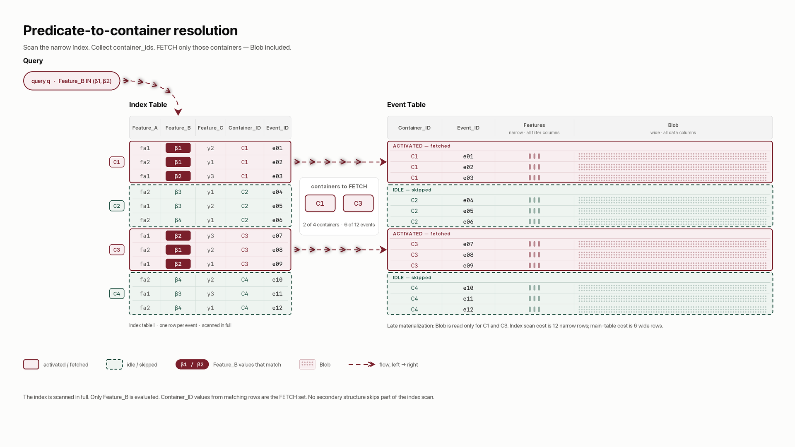
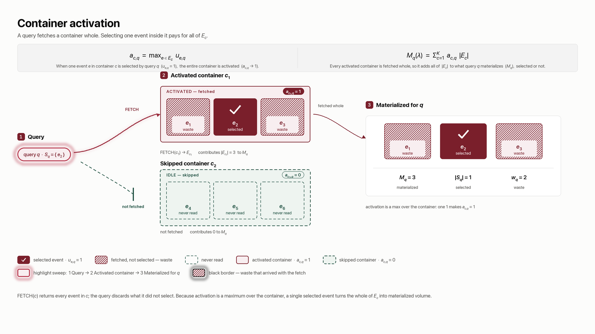

# The Data Storage Layout Problem

## Contents

1. **[Data storage and fetch model](#1-data-storage-and-fetch-model)**
   - [1.1 Predicate-to-container resolution](#11-predicate-to-container-resolution)
   - [1.2 Custom assignment overhead](#12-custom-assignment-overhead)
2. **[Objective function and system-wide data skipping](#2-objective-function-and-system-wide-data-skipping)**
   - [2.1 Observed workload](#21-observed-workload)
   - [2.2 Demand derived from the log](#22-demand-derived-from-the-log)
   - [2.3 Predicate and observed demand](#23-predicate-and-observed-demand)
   - [2.4 Container activation and materialization](#24-container-activation-and-materialization)
   - [2.5 Aggregate waste](#25-aggregate-waste)
   - [2.6 A patternless query](#26-a-patternless-query)
3. **[The effect of data clustering](#3-the-effect-of-data-clustering)**
   - [3.1 Distinct subgroup probabilities](#31-distinct-subgroup-probabilities)
   - [3.2 Allocating containers among groups](#32-allocating-containers-among-groups)
4. **[Container capacity bounds](#4-container-capacity-bounds)**
5. **[Problem Complexity Analysis](#5-problem-complexity-analysis)**
   - [5.1 Search space and hardness](#51-search-space-and-hardness)
   - [5.2 Assignment evaluation cost](#52-assignment-evaluation-cost)
   - [5.3 Impact of dynamic query patterns](#53-impact-of-dynamic-query-patterns)

---

## 1. Data storage and fetch model

This section describes the database operations that make event placement important. A data storage
system holds events in containers and serves a query—a database request that retains selected
events—by fetching entire containers. The layout question is how assigning events to those
containers changes the volume of data the system must fetch.

Let $E$ be the finite set of all stored events, and let $N = |E|$ be the number of events in that
set.

**Containers.** Each event is stored in exactly one of $K$ containers. The layout $\lambda$
records this assignment:

$$\lambda : E \rightarrow \{1, \dots, K\}.$$

For an event $e$, the value $\lambda(e)$ is the identifier of the container that holds it. The
notation $\lambda^{-1}(c)$ reverses this view: it means the set of all events whose assigned
container is $c$. The contents of container $c$ are therefore

$$E_c = \lambda^{-1}(c) = \{\,e \in E : \lambda(e) = c\,\}.$$

Because every event belongs to exactly one container, the containers partition the corpus and
their event counts sum to $N$:

$$\sum_c |E_c| = N.$$

Both event count and byte size are useful measures of data-fetch overhead. When every event is
treated as having size $1$, the storage size of container $c$ is represented by its event count
$|E_c|$. When events have different sizes, the container's storage size in bytes is represented by

$$\operatorname{bytes}(E_c) = \sum_{e \in E_c} \operatorname{size}(e).$$

Later storage-volume formulas can use $\operatorname{bytes}(E_c)$ instead of $|E_c|$. This changes
the unit of measurement, not the structure of the problem.

**Container fetch.** The storage system provides one data-fetch operation:

$$\texttt{FETCH}(c) \rightarrow E_c.$$

`FETCH(c)` returns every event stored in container $c$. It cannot retrieve just one event from the
container. The read cost is the volume returned by `FETCH`, even when the query keeps only some of
those events.

This restriction makes the layout matter. When a query needs one event, it must also read every
other event in the same container. If individual events could be retrieved at no additional cost,
their container assignment would not affect read cost.

The system serves a query in two phases:

1. **Resolve:** evaluate the query predicate—the filter over indexed event attributes—to identify
   the containers the query must fetch.
2. **Fetch:** call `FETCH` on each identified container, then discard events the query did not
   select.

### 1.1 Predicate-to-container resolution

A columnar store can evaluate a predicate by reading only the columns named in that predicate.
Other columns do not need to be materialized yet. This practice is **late materialization**:
narrow filtering columns are processed first, while dense columns containing large payloads,
nested context, or many attributes are fetched only after the system knows which containers it
needs.

Predicate-to-container resolution translates a query predicate into those container identifiers.
The solution pattern used here is a narrow index table ($I$) with one row per event:

| column | meaning |
| --- | --- |
| `features` | event attributes that queries can filter on |
| `container_id` | the event's current container, equal to $\lambda(e)$ |
| `record_id` | the event's identity |

To resolve a query, the system scans `features`, evaluates the predicate for every event, and
collects the corresponding `container_id` values. The resulting set identifies the containers the
query must fetch. No secondary structure allows the system to skip part of this index scan.

<picture>
  
</picture>

*Scan the narrow index, collect container identifiers, and fetch only those containers.*

The index has as many rows as the corpus, but each row is narrower than a complete event. The
index width ratio ($\rho$) compares their compressed sizes:

$$\rho =
\frac{\text{compressed bytes per index row}}
     {\text{compressed bytes per complete event}},
\qquad \rho \ll 1.$$

An index table changes how the system locates data, not which records the query returns. Several
index tables may coexist for different predicate families. Low-cardinality feature labels can
make an index especially compressible because their values repeat often.

Changing $\lambda$ rewrites `container_id` values but does not change the number of index rows or
the feature columns scanned. Index cost is therefore real and recurring but constant across
different assignments. Its central benefit is late materialization: the system resolves the predicate
using narrow columns before fetching dense columns from the identified main-table containers.

### 1.2 Custom assignment overhead

A custom assignment adds container-resolution work at two points in the data path.

At ingest time, **event-to-container resolution** applies the assignment rule to an arriving
event's features and produces its `container_id`. The rule must be deterministic, inexpensive,
and evaluable from that event alone. An assignment represented only as the output of a batch
computation over the complete corpus cannot route a new event without another global computation.

At query time, **predicate-to-container resolution** performs the index-table process in §1.1. It
evaluates the query predicate against indexed features and produces the container identifiers that
must be fetched.

Both steps consume compute, memory, and metadata capacity outside the container fetch itself.
Their overhead can be prohibitive in a low-latency system or a resource-constrained deployment,
even when the custom assignment would reduce main-table data fetched beyond the selected events. A deployable layout must
therefore fit the ingest-time routing budget and the query-time resolution budget.

---

## 2. Objective function and system-wide data skipping

The objective is built from one observed relation. This section introduces that relation and shows
how an assignment expands each query's fetch.

### 2.1 Observed workload

The workload is recorded in an append-only **selection log** with two columns:

| column | type | meaning |
| --- | --- | --- |
| `record_id` | bigint | the event selected |
| `query_id` | bigint | the query that selected it |

One row records one selection. A row's presence means that the query selected the event; its
absence means that the query did not. The table stores no Boolean column and no negative rows.
This keeps its size proportional to the selections actually observed instead of the much larger
product of event count and query count.

Formally, the selection log is a relation

$$L \subseteq E \times \mathcal{Q},$$

where $\mathcal{Q}$ is the set of $Q$ distinct queries. Queries have no separate frequency
weight. If the same query text runs repeatedly, each execution receives its own `query_id`, so
repetition is represented directly in the log.

### 2.2 Demand derived from the log

For one query, collect the events it selected:

$$S_q = \{\,e : (e,q)\in L\,\}.$$

For one event, collect the queries that selected it:

$$\operatorname{supp}(e)=\{\,q : (e,q)\in L\,\}.$$

The total number of observed selections is

$$|L|=\sum_q |S_q|.$$

The queries that must fetch a container are the union of the supports of its events:

$$\operatorname{supp}(c)=\bigcup_{e\in E_c}\operatorname{supp}(e).$$

For compact notation, let the selection indicator $u_{e,q}$ equal $1$ when $(e,q)\in L$ and $0$
otherwise. Placing all indicators into a matrix gives the selection matrix

$$U\in\{0,1\}^{N\times Q},\qquad \lVert U\rVert_1=|L|.$$

The matrix is a mathematical view, not a stored object. The selection log is its sparse
representation.

An event selected by no observed query has no row in the log. It still exists in the corpus and
must still be assigned to a container. Such events are easy to overlook because the workload
contains no positive observation for them.

### 2.3 Predicate and observed demand

The selection log records which events a query selected, not why it selected them. A selection set
need not be recoverable from the query's stated predicate over event attributes. Joins, lists of
identifiers, and context outside the event row can all create demand that the event schema does
not announce.

The assignment is therefore fitted to observed demand in $L$, not merely to columns named in query
text.

### 2.4 Container activation and materialization

A query **activates** a container when that container holds at least one selected event. The
activation indicator is

$$a_{c,q}=\max_{e\in E_c}u_{e,q}\in\{0,1\}.$$

The system must fetch every activated container. The event count materialized for query $q$ is

$$M_q(\lambda)=\sum_{c=1}^{K}a_{c,q}|E_c|.$$

This count cannot be smaller than the query's selected-event count:

$$M_q(\lambda)\ge |S_q|.$$

Equality holds only when every event in every activated container was selected by the query.

**Index cost and skipping.** A full index scan costs $\rho N$ in event-volume units, while
fetching the complete main table costs $N$. Serving query $q$ adds its materialized event count
$M_q$. The index saves work exactly when

$$\rho N+M_q<N.$$

The share of the corpus that query $q$ avoids reading is its skipping ratio $\sigma_q$:

$$\sigma_q=1-\frac{M_q}{N}.$$

The index therefore saves work when

$$\sigma_q>\rho.$$

The number of queries that activate container $c$ is its demand breadth:

$$d_c(\lambda)=\sum_q a_{c,q}
=\bigl|\operatorname{supp}(c)\bigr|.$$

<picture>
  
</picture>

*One selected event activates the whole container. A container with no selected event is
skipped.*

### 2.5 Aggregate waste

A query pays for every materialized event but uses only the events in its selection set. The
difference is that query's waste:

$$w_q(\lambda)=M_q(\lambda)-|S_q|\ge 0.$$

Aggregate waste over the observed workload is the objective:

$$\boxed{\mathcal{W}(\lambda)
=\sum_q w_q(\lambda)
=\sum_q\bigl(M_q(\lambda)-|S_q|\bigr)}.$$

This is the complete abstract goal: choose an assignment $\lambda$ that minimizes
$\mathcal{W}(\lambda)$.

The displayed objective uses event counts. Its byte-weighted form replaces each container count
$|E_c|$ inside $M_q$ with $\operatorname{bytes}(E_c)$ and replaces the selected-event count
$|S_q|$ with $\sum_{e\in S_q}\operatorname{size}(e)$. Both terms then use bytes.

The total workload cost separates into three parts:

$$
\underbrace{Q\rho N}_{\text{index scans}}
+
\underbrace{|L|}_{\text{selected events}}
+
\underbrace{\mathcal{W}(\lambda)}_{\text{waste}}.
$$

Only waste changes with the assignment. Index-scan cost is constant across layouts, and the
selected events are fixed by the observed log. Removing those constants does not change which
layout minimizes total cost.

The same objective has two useful interpretations. First, let the materialized selection matrix
($\tilde U$) mark event $e$ for query $q$ whenever that query activates the event's container:

$$\tilde u_{e,q}=a_{\lambda(e),q}.$$

Then

$$\mathcal{W}(\lambda)=\lVert\tilde U\rVert_1-\lVert U\rVert_1.$$

A layout spreads each observed selection across the selected event's container. Waste counts the
zeros in $U$ that this spreading turns into ones.

Second, exchanging the order of summation shows the cost accumulated by each container:

$$\sum_q M_q(\lambda)=\sum_c |E_c|\,d_c(\lambda).$$

Because $|L|$ is constant, minimizing waste is equivalent to

$$
\min_\lambda
\sum_{c=1}^{K}
\underbrace{|E_c|}_{\text{container size}}
\cdot
\underbrace{\left|\bigcup_{e\in E_c}\operatorname{supp}(e)\right|}_{\text{demand breadth}}.
$$

Each container is charged its event count multiplied by the number of queries that fetch it.

### 2.6 A patternless query

As a baseline with no demand structure, suppose one query selects every event independently with
the same probability $p$. Events then differ only by chance, so their assignment provides no
pattern to exploit.

For container $c$, the selected-event count ($X_c$) is

$$X_c=|S_q\cap E_c|.$$

If the container holds $|E_c|$ events, then

$$X_c\sim\operatorname{Binomial}(|E_c|,p).$$

The container is skipped exactly when it contains no selected event. Its exact skip probability
is therefore

$$P(X_c=0)=(1-p)^{|E_c|}.$$

The expected system-wide container-skipping ratio is the average of these probabilities:

$$
\mathbb{E}[\text{container-skipping ratio}]
=\frac{1}{K}\sum_{c=1}^{K}(1-p)^{|E_c|}.
$$

For a highly selective predicate—meaning a small selected fraction $p$—the binomial selected-event
count can be approximated by a Poisson count. The skipping ratio then has the approximation

$$
\mathbb{E}[\text{container-skipping ratio}]
\approx
\frac{1}{K}\sum_{c=1}^{K}e^{-p|E_c|}.
$$

The repository appendix derives the approximation error. Event count is used here to keep the
model readable; when record sizes differ, a skipped-container ratio and skipped-byte ratio measure
different outcomes.

---

## 3. The effect of data clustering

The corpus-wide selected fraction does not change when events are clustered. Clustering replaces
the patternless assumption of one universal probability with group-specific demand estimates and
uses those differences when assigning container capacity.

### 3.1 Distinct subgroup probabilities

Suppose a predicate-to-group mapping partitions the corpus into $m$ logical groups. Let $G_g$
denote group $g$, let $N_g$ be its event count, and let $p_g$ be the estimated probability that one
of its events is selected by the query family being modeled.

The corpus contains

$$N=\sum_g N_g$$

events. Its overall expected selected fraction remains the weighted average

$$\bar p=\frac{1}{N}\sum_g N_gp_g.$$

The mapping does not create or remove query demand. It exposes that demand is concentrated
differently across logical groups.

### 3.2 Allocating containers among groups

Let $K_g$ be the number of containers assigned to group $g$. The allocations use the available
container budget:

$$\sum_g K_g=K.$$

For this analytical expression, assume $K_g$ divides $N_g$ and group $g$ is divided into
equal-sized containers of $N_g/K_g$ events. Under independent selection within the group, the
expected number of containers skipped across the system is

$$
\boxed{
\mathbb{E}[\text{skipped containers}]
=
\sum_g K_g(1-p_g)^{N_g/K_g}
\;\approx\;
\sum_g K_g\exp\left(-\frac{N_gp_g}{K_g}\right)
}.
$$

The expression on the right is the small-$p_g$ Poisson approximation. Given the logical groups and
their estimated demand, the allocation problem chooses how many containers each group receives.
Assignments can improve skipping by concentrating demand that the universal-$p$ baseline treated
as indistinguishable.

A single $p_g$ describes marginal selection frequency, not correlations among events. Real
clustering can also place events commonly selected together into the same containers; the observed
selection log retains that richer information. Record sizes can differ as well, so the formal
waste objective continues to count materialized volume rather than treating every skipped
container as equally valuable.

---

## 4. Container capacity bounds

Container capacity determines how much data one fetch can materialize. It must remain between
storage-system bounds:

$$s_{\min}\le |E_c|\le s_{\max}.$$

The lower bound amortizes fixed request and bookkeeping cost across enough events. The upper bound
prevents a container from becoming so large that almost every query activates it and data skipping
loses its value.

In a cloud data lake backed by object storage, very small containers create the familiar
**small-file problem**. Every file adds object requests, transaction-log entries, metadata work,
scan tasks, and eventual compaction work. The fixed cost can dominate the useful bytes read, so
these systems need a substantial lower capacity bound.

Distributed databases running on SSD-backed persistence can often tolerate smaller containers.
Random access has lower latency, and storage metadata and scheduling are more tightly integrated
with the database engine. Small units are still not free: they consume metadata, file handles,
cache entries, and compaction or write-amplification budget. The acceptable lower bound is simply
smaller and more system-dependent.

At the extreme, assign every event to its own container. This layout produces zero waste because a
query never fetches an unselected neighbor, but it also creates $K=N$ containers and pays the fixed
management cost once per event. The closet analogy makes the failure immediate: one garment per
drawer eliminates unwanted handling, but the number of drawers, labels, and drawer operations
becomes unsustainable.

Splitting a container cannot increase waste, so the objective alone always prefers finer
containers. Capacity bounds supply the opposing production constraint. Their practical values are
properties of the storage system, and real layouts evaluate the resulting size distribution
rather than requiring every container to have exactly the same size.

---

## 5. Problem Complexity Analysis

### 5.1 Search space and hardness

A candidate layout partitions $N$ events into non-empty containers. Suppose a selected container
capacity $s$ produces $K_s$ containers. Before applying the size constraints, the number of
partitions into exactly that many containers is

$$S(N,K_s),$$

where $S(N,k)$ is a Stirling number of the second kind: the number of ways to partition $N$
distinct events into exactly $k$ non-empty containers.

Container capacity is itself adjustable. For a set of permitted capacities $\mathcal{C}$, the
number of layout-and-capacity configurations is bounded above by

$$
\sum_{s\in\mathcal{C}}S(N,K_s).
$$

This sum expresses two coupled choices: select a capacity, then select a partition admissible at
that capacity. Container-size constraints remove invalid partitions, and the same partition may be
valid under more than one capacity, but neither fact makes exhaustive search practical. Even with
fixed $K_s$, the Stirling count grows exponentially with the number of events. If the permitted
capacities produce similarly large partition spaces, their count acts as another multiplicative
search axis. Moving one event can also change the query demand of an entire container, so candidate
costs cannot be evaluated as independent choices for each event.

### 5.2 Assignment evaluation cost

Evaluating one assignment requires a simulation with three stages.

1. **Collect the workload.** Record which events historical queries selected in the selection log.
   This input grows with the number of queries and the number of selected events.
2. **Build the candidate mapping.** Apply the assignment to every event and build the per-event
   mapping from `record_id` to `container_id`. A complete storage simulation may materialize this
   mapping as the index table; the mathematical score needs only the identity, container, and
   event-size columns.
3. **Replay and aggregate.** Join every selection-log row to the candidate mapping, identify each
   query–container activation, sum the activated container sizes, and subtract the selected event
   count.

The scale of a modern data warehouse makes every stage consequential. The corpus may contain
billions of events, the observation period may produce a selection log much larger than the
corpus, and each candidate requires another assignment mapping and replay. Workload collection and
index-table construction are preparation costs; replaying the selection log is the repeated
evaluation cost. A search that scores many assignments pays that repeated cost for every candidate.

### 5.3 Impact of dynamic query patterns

Event selection changes over time as seasons, products, customers, and business functions change.
A layout learned from an earlier workload therefore tends to lose skipping advantage as it ages,
although recurring seasonal demand can temporarily make an older layout useful again. A closet
has the same behavior: drawers arranged around winter outfits become less effective in summer,
then may become useful when winter returns.

For a simple comparison, assume the complete corpus is ingested once at the beginning of a fixed
study period $T$. No events arrive or expire during the period. The candidate layout $\lambda$ and
a naive baseline layout $\lambda_{\mathrm{base}}$, such as insertion-order partitioning with no
feature learning, are each constructed once over the same corpus. Both then serve the same query
stream until the study ends.

The total data-skipping benefit is the difference between the baseline's total query-read cost and
the candidate's total query-read cost over the whole study. The layout overhead is also measured
comparatively: the candidate's one-time construction and enforcement cost minus the corresponding
cost of creating the baseline.

Write $C_{\mathrm{read}}^\lambda(T)$ and $C_{\mathrm{read}}^{\mathrm{base}}(T)$ for the two total
query-read costs. Write $C_{\mathrm{layout}}^\lambda$ and
$C_{\mathrm{layout}}^{\mathrm{base}}$ for their one-time layout costs.

The candidate's total net advantage is

$$
\operatorname{Advantage}(T)
=
\left[
C_{\mathrm{read}}^{\mathrm{base}}(T)
-
C_{\mathrm{read}}^{\lambda}(T)
\right]
-
\left[
C_{\mathrm{layout}}^{\lambda}
-
C_{\mathrm{layout}}^{\mathrm{base}}
\right].
$$

A positive value means the accumulated skipping benefit repaid the candidate's additional layout
overhead before the study ended. A negative value means the baseline cost less overall. The
comparison evaluates the layout as one system-wide decision over the full retained corpus, so
containers may hold events from any part of the bulk ingestion. Query-pattern drift appears through
the read costs accumulated over time rather than through separate per-epoch layouts.
